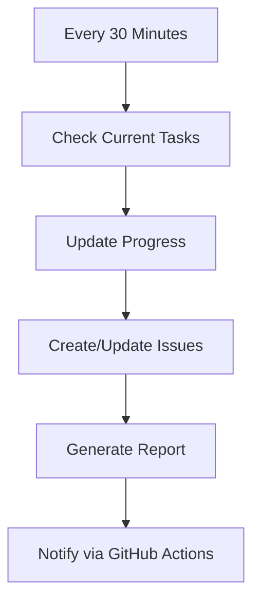

# 💰 GitHub Income Strategies

Sistem automasi untuk menghasilkan uang di GitHub menggunakan 6 metode utama.

## 🎯 6 Metode Menghasilkan Uang di GitHub

| # | Metode | Status | Potential Income |
|---|--------|--------|------------------|
| 1 | [GitHub Sponsors](./1-github-sponsors.md) | 🔴 Not Started | $100 - $10,000+/bulan |
| 2 | [GitHub Marketplace](./2-marketplace.md) | 🔴 Not Started | $500 - $50,000+/bulan |
| 3 | [Open Source Business](./3-open-source-business.md) | 🔴 Not Started | $1,000 - $100,000+/bulan |
| 4 | [Popular Projects](./4-popular-projects.md) | 🔴 Not Started | Freelance $50-500/jam |
| 5 | [GitHub Actions](./5-github-actions.md) | 🔴 Not Started | $100 - $10,000+/bulan |
| 6 | [Bug Bounty](./6-bug-bounty.md) | 🔴 Not Started | $100 - $100,000+/bug |

## 🔄 Automated Progress

## 📊 Progress Dashboard

### Current Progress
- [ ] Setup GitHub Sponsors profile
- [ ] Identify marketplace opportunities
- [ ] Build first popular open source project
- [ ] Create GitHub Actions templates
- [ ] Register for bug bounty programs

## 🚀 Quick Start

1. **Fork atau Star** repo ini untuk tracking
2. **Check Issues** untuk task yang perlu dikerjakan
3. **Watch Repo** untuk notifikasi progress
4. **Automation** berjalan setiap 30 menit

## 📝 Daily Tasks (Updated by Automation)

### GitHub Sponsors
- [ ] Optimize profile description
- [ ] Add sponsorship tiers
- [ ] Promote sponsorship on social media

### GitHub Marketplace
- [ ] Research popular tools
- [ ] Build minimum viable product
- [ ] Submit to marketplace

### Open Source Business
- [ ] Create compelling README
- [ ] Add documentation
- [ ] Build community

### Popular Projects
- [ ] Contribute to trending repos
- [ ] Create useful tools
- [ ] Engage with community

### GitHub Actions
- [ ] Create reusable workflows
- [ ] Document usage
- [ ] Publish to marketplace

### Bug Bounty
- [ ] Register on bounty platforms
- [ ] Learn security testing
- [ ] Find and report vulnerabilities

## 🤖 Automation System

### How It Works

### Workflow Triggers

| Trigger | Frequency | Purpose |
|---------|-----------|---------|
| Schedule | Every 30 min | Update progress, check tasks |
| Push | On commit | Sync changes |
| Manual | On demand | Force refresh |

## 📈 Metrics Tracking

| Metric | Target | Current |
|--------|--------|---------|
| GitHub Stars | 1,000 | 0 |
| Sponsors | 10 | 0 |
| Marketplace Apps | 1 | 0 |
| Open Source Projects | 5 | 0 |
| Bug Bounties Found | 10 | 0 |
| Total Earnings | $10,000 | $0 |

## 🔗 Resources

- [GitHub Sponsors](https://github.com/sponsors)
- [GitHub Marketplace](https://github.com/marketplace)
- [Bug Bounty Platforms](https://www.bugcrowd.com, https://www.hackerone.com)
- [Open Source Guides](https://opensource.guide/)

## 💡 Tips

1. **Start Small**: Pilih satu metode dan kuasai
2. **Build Value**: Fokus memberikan value ke komunitas
3. **Consistency**: Progress kecil tapi konsisten
4. **Network**: Bangun connections dengan developers lain
5. **Document**: Dokumentasikan semua yang kamu lakukan

## 📄 License

MIT License - Feel free to use and modify

---

*Generated by OpenHands Automation - Last updated: Never*
